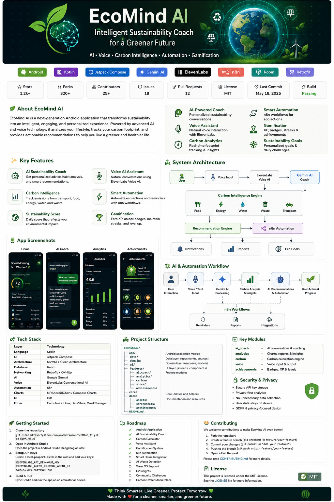
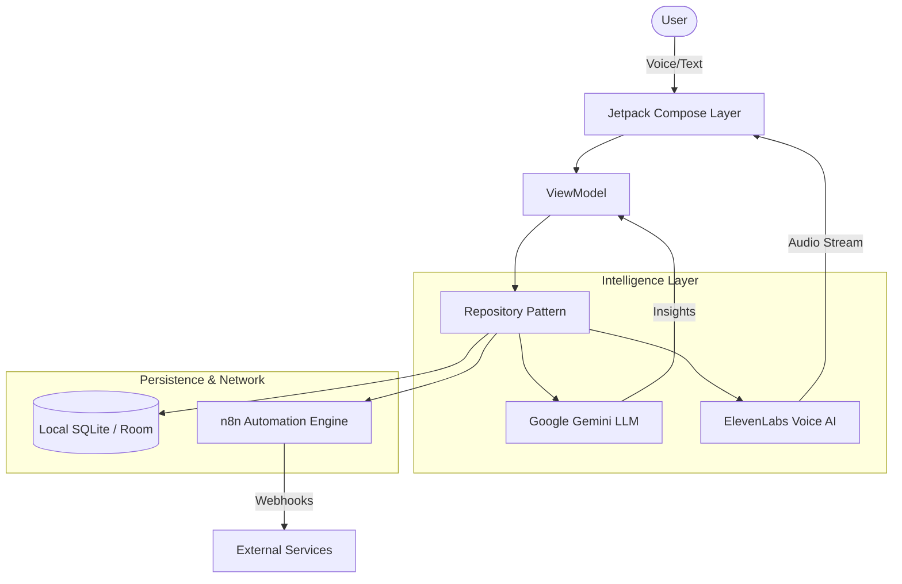
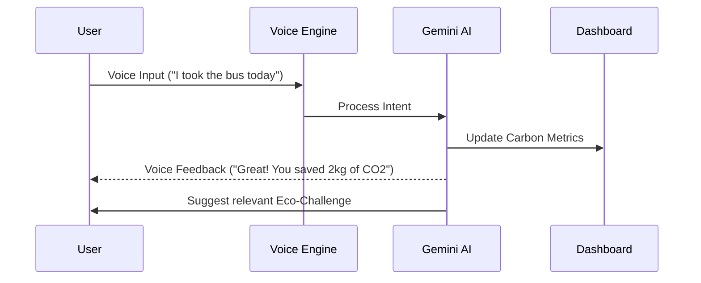

# EcoMind AI
**Intelligent Sustainability Coach for a Greener Future**

[](https://opensource.org/licenses/MIT)
[](https://kotlinlang.org/)
[](https://www.android.com/)
[]()

---

<p align="center">
  
</p>

## 📋 Project Overview

EcoMind AI is a production-grade Android application designed to transform how individuals interact with sustainability. By leveraging cutting-edge Artificial Intelligence, the platform provides a seamless, personalized experience for habit tracking, carbon analytics, and environmental education.

Traditional sustainability apps often feel like chores; EcoMind AI changes this by introducing an **Ambient AI Coach** that engages users through natural voice and intelligent insights, making the journey to a zero-emission lifestyle intuitive and rewarding.

---

## 🎯 Why EcoMind AI?

Climate change is an complex challenge, and individual impact often feels invisible. EcoMind AI bridges this gap by:
- **Quantifying Impact**: Turning abstract carbon data into actionable daily metrics.
- **Lowering Friction**: Using Voice AI to make logging and learning as natural as a conversation.
- **Ensuring Consistency**: Utilizing gamification and smart automation to turn one-time actions into lifelong habits.

---

## 🚀 Key Features

### 🤖 AI Sustainability Coach
A sophisticated assistant powered by Google Gemini that analyzes your lifestyle patterns and provides high-context habit recommendations.

### 🎙️ Voice AI Assistant
Hands-free interaction using ElevenLabs Conversational AI, allowing users to log activities and ask questions through natural speech.

### 📊 Carbon Footprint Analytics
Real-time tracking of emissions across transport, food, and energy sectors with visual data breakdowns and historical comparisons.

### 🏆 Gamification (XP & Badges)
A tiered progression system (Starter to Planet Guardian) that rewards sustainable choices with XP and collectible metallic badges.

### ⚙️ Smart Automation
Integration with n8n workflows to automate eco-reminders and coordinate with external smart-home or workspace ecosystems.

---

## 🛠️ Technology Stack

| Layer | Technology |
| :--- | :--- |
| **Language** | Kotlin (100%) |
| **UI Framework** | Jetpack Compose (Modern Declarative UI) |
| **Architecture** | MVVM + Clean Architecture |
| **Local Database** | Room Persistence Library |
| **Networking** | Retrofit + OkHttp + WebSockets |
| **AI (LLM)** | Google Gemini Pro |
| **AI (Voice)** | ElevenLabs Conversational AI |
| **Automation** | n8n Webhook Architecture |
| **Concurrency** | Kotlin Coroutines & Flow |

---

## 🏗️ System Architecture

The following diagram illustrates the high-level data flow and component interaction within the EcoMind AI ecosystem:



---

## 📂 Project Structure

The project follows a modularized package-by-feature structure to ensure scalability and maintainability:

```text
com.example.ui/
├── screens/         # Feature-specific UI (Home, Chat, Dashboard)
├── viewmodel/       # UI Logic and State Management
├── speech/          # Voice AI Integration (ElevenLabs)
└── theme/           # Design System (Colors, Typography, Shapes)

com.example.data/
├── local/           # Room DB, Entities, and DAOs
├── model/           # DTOs and Domain Models
├── network/         # Retrofit Services and API Definitions
└── repository/      # Single Source of Truth for data
```

---

## ⚙️ Installation & Setup

### 1. Clone the Repository
```bash
git clone https://github.com/pradhotkumar/EcoMind_AI.git
cd EcoMind_AI
```

### 2. Environment Variable Setup
EcoMind AI uses the [Secrets Gradle Plugin](https://github.com/google/secrets-gradle-plugin). Create a `.env` file in the root directory:

```env
# Required for Voice Interaction
ELEVENLABS_API_KEY=your_elevenlabs_api_key
ELEVENLABS_AGENT_ID=your_agent_id

# Required for AI Coaching
GEMINI_API_KEY=your_gemini_api_key
```

### 3. Build & Run
1. Open the project in **Android Studio Ladybug (or newer)**.
2. Sync the project with Gradle files.
3. Select an emulator or physical device (Min SDK 24).
4. Click **Run**.

---

## 🔄 AI & Automation Workflow



---

## 📱 App Screenshots

| Home Interface | AI Coach Call |
| :---: | :---: |
|  |  |

| Carbon Dashboard | Achievement System |
| :---: | :---: |
|  |  |

---

## 🗺️ Roadmap

- [x] Initial MVP with Carbon Tracking
- [x] ElevenLabs Voice Integration
- [x] Google Gemini Coaching Engine
- [ ] **Phase 2**: Smart Home IoT Integration (Philips Hue/Nest)
- [ ] **Phase 3**: Community Leaderboards and Social Challenges
- [ ] **Phase 4**: Wear OS Companion App for micro-logging
- [ ] **Phase 5**: AI-powered waste detection via Camera API

---

## 🤝 Contributing

We welcome contributions to EcoMind AI. To ensure a professional environment, please follow these steps:
1. Fork the repository.
2. Create a feature branch (`git checkout -b feature/AmazingFeature`).
3. Commit your changes using [Conventional Commits](https://www.conventionalcommits.org/).
4. Push to the branch.
5. Open a Pull Request.

---

## 📄 License

This project is licensed under the MIT License - see the [LICENSE](LICENSE) file for details.

---

<p align="center">
  <b>Think Smarter. Live Greener. Protect Tomorrow.</b><br>
  Made with ❤️ for a cleaner and more intelligent future.
</p>
