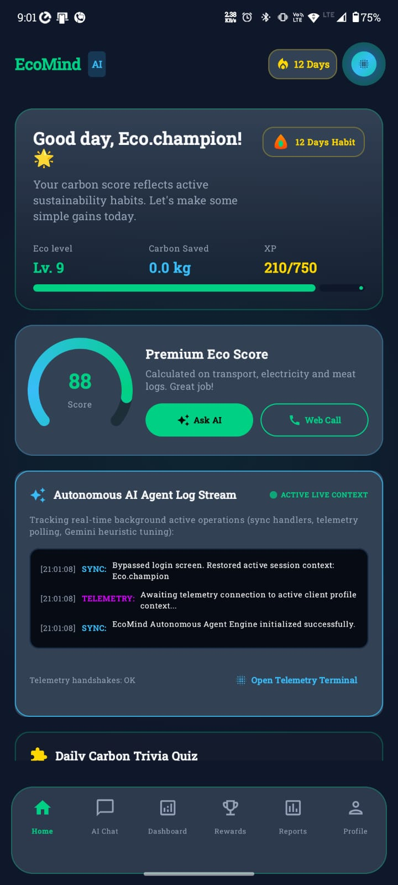
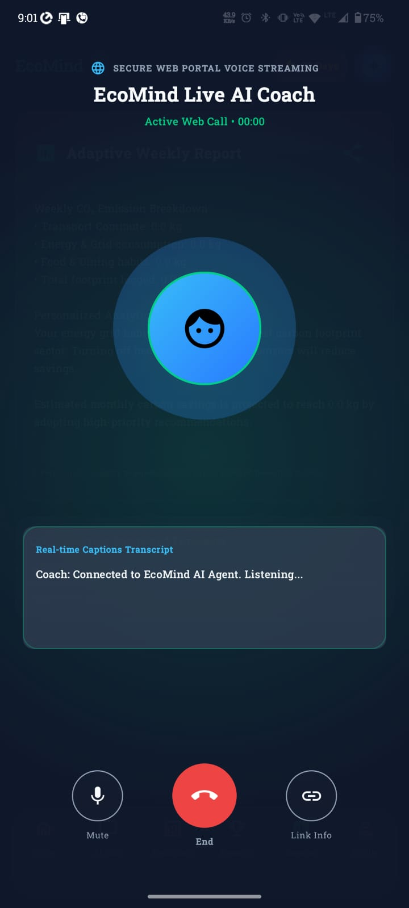
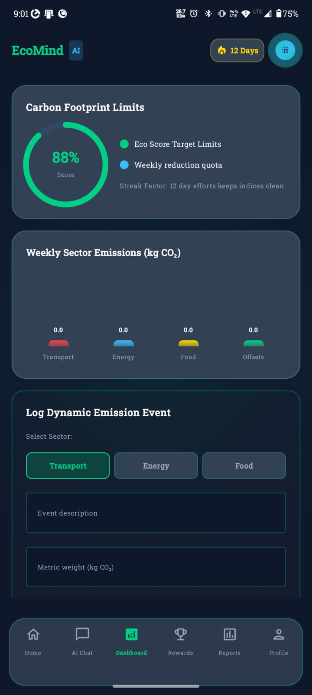
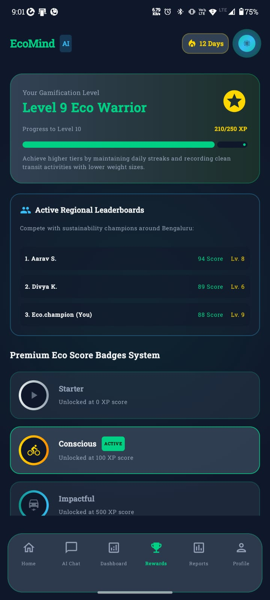

# 🌍 EcoMind AI

> **An AI-powered sustainability coach that helps users build eco-friendly habits through voice conversations, carbon analytics, and intelligent recommendations.**

---

## 📖 Overview

EcoMind AI is an Android application designed to make sustainable living simple and engaging.

Using Artificial Intelligence, Voice AI, and Carbon Analytics, the app helps users understand their environmental impact, reduce their carbon footprint, and develop long-term sustainable habits.

Whether it's tracking transportation emissions, reducing electricity usage, or improving daily lifestyle choices, EcoMind AI acts as a personal sustainability companion.

---

## ✨ Features

- 🤖 AI Sustainability Coach
- 🎙️ Natural Voice Conversations
- 📊 Carbon Footprint Analytics
- 🌱 Personalized Eco Recommendations
- ⚡ Smart Automation with n8n
- 🏆 XP, Badges & Achievement System
- 📅 Daily Sustainability Challenges
- 📈 Weekly & Monthly Progress Reports
- 🌍 Sustainability Score

---

## 📱 App Screens

| Home | AI Coach |
|------|----------|
|  |  |

| Analytics | Achievements |
|-----------|--------------|
|  |  |

---

## 🏗️ Tech Stack

| Category | Technology |
|----------|------------|
| Language | Kotlin |
| UI | Jetpack Compose |
| Architecture | MVVM |
| Database | Room |
| Networking | Retrofit + OkHttp |
| AI | Google Gemini |
| Voice AI | ElevenLabs |
| Automation | n8n |
| Charts | MPAndroidChart |

---

## 📂 Project Structure

```text
EcoMindAI/
│
├── app/
├── data/
├── domain/
├── ui/
├── features/
├── docs/
│   ├── screenshots/
│   └── assets/
├── gradle/
└── README.md
```

---

## 🚀 Getting Started

### Clone the Repository

```bash
git clone https://github.com/pradhotkumar/EcoMind_AI.git
```

### Open the Project

Open the project using **Android Studio**.

### Configure API Keys

Create a `.env` file (or use `local.properties`) and add:

```env
ELEVENLABS_API_KEY=YOUR_API_KEY
ELEVENLABS_AGENT_ID=YOUR_AGENT_ID
GEMINI_API_KEY=YOUR_API_KEY
```

### Run

Build and run the application on an Android emulator or physical device.

---

## 🛣️ Roadmap

- ✅ AI Sustainability Coach
- ✅ Carbon Footprint Calculator
- ✅ Voice AI Integration
- ✅ Gamification System
- ⏳ Smart Home Integration
- ⏳ AI Waste Detection
- ⏳ Wear OS Support
- ⏳ Community Challenges
- ⏳ Carbon Offset Marketplace

---

## 🤝 Contributing

Contributions are welcome!

1. Fork the repository
2. Create a feature branch
3. Commit your changes
4. Open a Pull Request

---

## 📄 License

This project is licensed under the **MIT License**.

---

## 💚 Vision

EcoMind AI aims to make sustainable living accessible through Artificial Intelligence by helping users understand their environmental impact and encouraging small daily actions that create meaningful change.

> **Think Smarter. Live Greener. 🌱**
